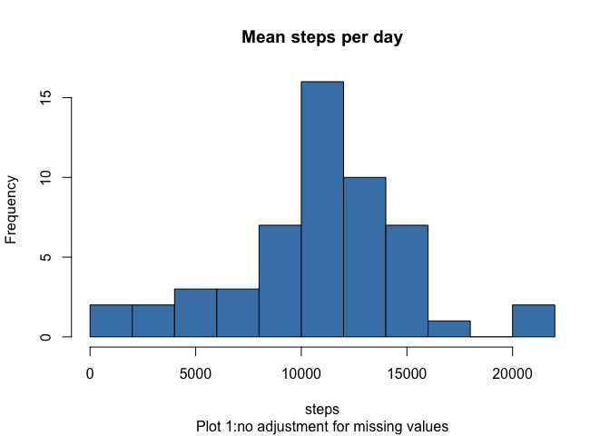
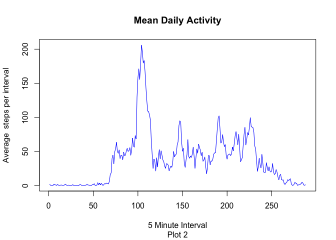
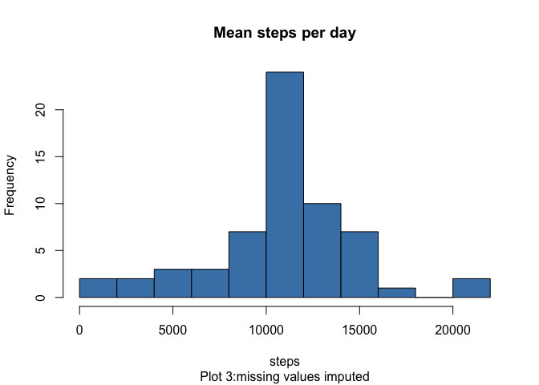
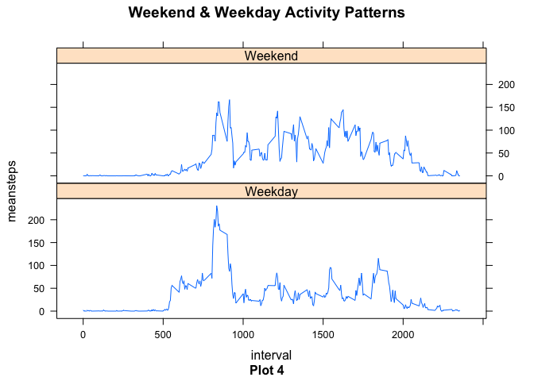

# PA1.Template
slc  
12 Apr 2016  
###Loading and preprocessing the data

```r
require(knitr)
```

```
## Loading required package: knitr
```

```r
require(dplyr)
```

```
## Loading required package: dplyr
```

```
## 
## Attaching package: 'dplyr'
```

```
## The following objects are masked from 'package:stats':
## 
##     filter, lag
```

```
## The following objects are masked from 'package:base':
## 
##     intersect, setdiff, setequal, union
```

```r
require(lubridate)
```

```
## Loading required package: lubridate
```

```r
require(lattice)
```

```
## Loading required package: lattice
```

```r
opts_chunk$set(echo=TRUE,results="show")
activity <- read.csv("~/Dropbox/John hopkins/reproducible research/activity.csv")
head(activity)
```

```
##   steps       date interval
## 1    NA 2012-10-01        0
## 2    NA 2012-10-01        5
## 3    NA 2012-10-01       10
## 4    NA 2012-10-01       15
## 5    NA 2012-10-01       20
## 6    NA 2012-10-01       25
```

```r
str(activity)
```

```
## 'data.frame':	17568 obs. of  3 variables:
##  $ steps   : int  NA NA NA NA NA NA NA NA NA NA ...
##  $ date    : Factor w/ 61 levels "2012-10-01","2012-10-02",..: 1 1 1 1 1 1 1 1 1 1 ...
##  $ interval: int  0 5 10 15 20 25 30 35 40 45 ...
```
###What is the mean total number of steps taken per day?
*Total number of steps by day*

```r
sumsteps<-activity %>%
filter(!is.na(steps)) %>%
group_by(date) %>%
select(steps)%>%
summarise(steps= sum(steps) )%>%
print(sumsteps)
```

```
## Source: local data frame [53 x 2]
## 
##          date steps
##        (fctr) (int)
## 1  2012-10-02   126
## 2  2012-10-03 11352
## 3  2012-10-04 12116
## 4  2012-10-05 13294
## 5  2012-10-06 15420
## 6  2012-10-07 11015
## 7  2012-10-09 12811
## 8  2012-10-10  9900
## 9  2012-10-11 10304
## 10 2012-10-12 17382
## ..        ...   ...
```

```r
with(sumsteps,hist(steps,breaks=10,col = "steelblue",main="Mean steps per day",sub="Plot 1:no adjustment for missing values"))
```



*Mean and Median steps per day*

```r
mean(sumsteps$steps)
```

```
## [1] 10766.19
```

```r
median(sumsteps$steps)
```

```
## [1] 10765
```

###What is the average daily activity pattern?

```r
act_na<-subset(activity,!is.na(steps))
actbyday<-tapply(act_na$steps, act_na$interval, mean)
plot( actbyday, type = "l",col="blue", xlab = "5 Minute Interval", main = "Mean Daily Activity",sub = "Plot 2" ,ylab = "Average  steps per interval")
```



*Which  mean 5 minute interval contains the maximum number of steps?*

```r
actbyday[which.max(actbyday)]
```

```
##      835 
## 206.1698
```

The 5 minute interval between 855 and 900 ( 8.55-9.0.clock) has the maximum mean number of steps (steps=835) .

###Imputing  missing values
*Total number of missing values$

```r
activity2<- activity
missvalues<- is.na(activity2$steps)
sum(missvalues)
```

```
## [1] 2304
```


```r
#replacing missing values with interval mean
meanstepsint<- tapply(activity2$steps, activity2$interval, mean, na.rm=TRUE, simplify = TRUE)
activity2$steps[missvalues] <- meanstepsint[as.character(activity2$interval[missvalues])]
```
*Total steps per day with missing values imputed*

```r
sumsteps2<-activity2 %>%
group_by(date) %>%
select(steps)%>%
summarise(steps= sum(steps) )%>%
print(sumsteps2)
```

```
## Source: local data frame [61 x 2]
## 
##          date    steps
##        (fctr)    (dbl)
## 1  2012-10-01 10766.19
## 2  2012-10-02   126.00
## 3  2012-10-03 11352.00
## 4  2012-10-04 12116.00
## 5  2012-10-05 13294.00
## 6  2012-10-06 15420.00
## 7  2012-10-07 11015.00
## 8  2012-10-08 10766.19
## 9  2012-10-09 12811.00
## 10 2012-10-10  9900.00
## ..        ...      ...
```
*Mean and Median steps per day for imputed data set*

```r
mean(sumsteps2$steps)
```

```
## [1] 10766.19
```

```r
median(sumsteps2$steps)
```

```
## [1] 10766.19
```
 
 Mean total daily steps are  identical before and after imputing missing  values. The only change is that before  correction  the median  was slightly lower than the mean , indicating a very slight skew in the data. After imputing missing values the median is equal the mean. Perhaps this isnot surprising considering  that missing values  were replaced  by the mean of the missing  interval.


```r
with(sumsteps2,hist(steps,breaks=10,col = "steelblue",main="Mean steps per day",sub="Plot 3:missing values imputed"))
```



The main difference between plots 1 and 3(other than the greater frequencies reflecting more values ) is that the height of the most frequent value appears increased relative to the other values. This also is not surprising considering the technique used to replace values.

###Are there differences in activity patterns between weekdays and weekends?

```r
#meansteps for  weekends vs weekdays 
activity2<- activity2%>%
mutate(day= ifelse(wday(activity2$date)==7 | wday(activity2$date)==1, "Weekend", "Weekday"))
activity_day_week<- activity2%>%
group_by(interval, day)%>%
summarise(meansteps = mean(steps))

xyplot(meansteps ~ interval | day, data=activity_day_week, type="l",main="Weekend & Weekday Activity Patterns",sub="Plot 4",layout=c(1,2))
```



We can see that subjects tend to be active earlier on  weekdays than weekends , but  are more physically active throughout the day at weekends than weekdays, and furthermore more  active until slightly later in the day.
note later-alternative imputing:
data <- merge(data, dataInterval)
data <- mutate(data, stepsImputed = ifelse(is.na(steps), meanSteps, steps), meanSteps = NULL)
data <- arrange(data, date, interval)
